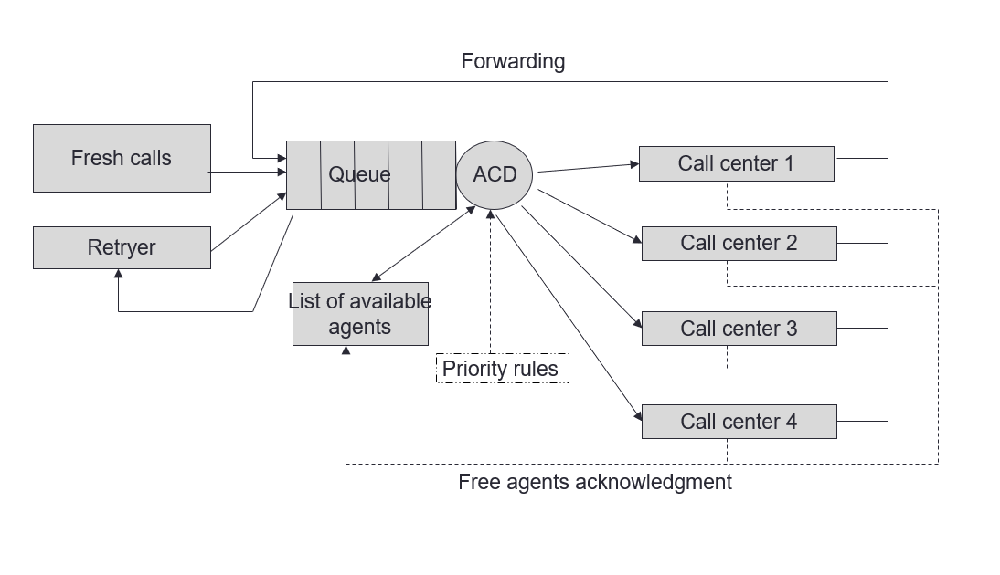
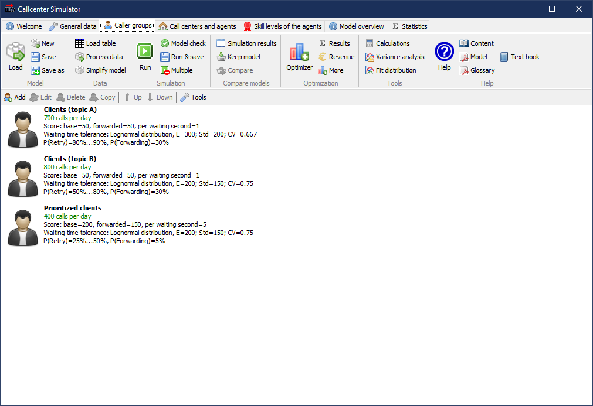
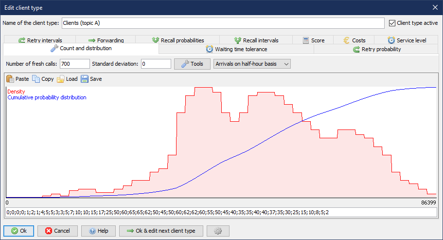
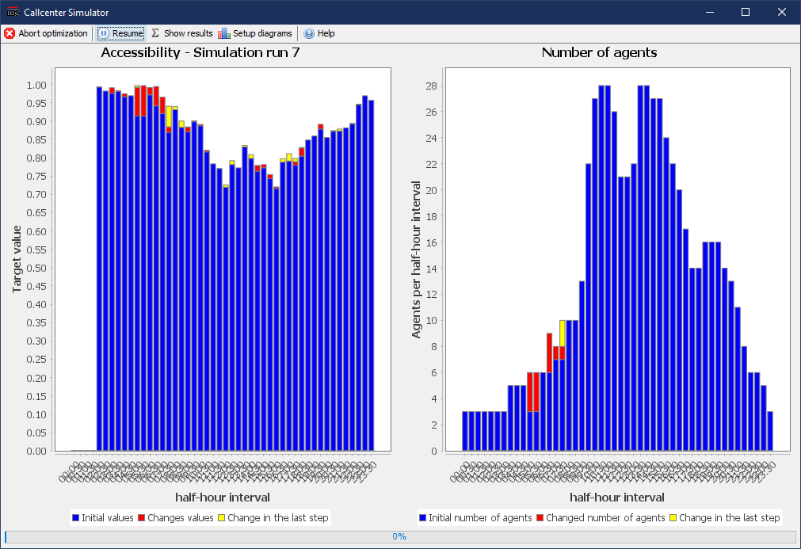
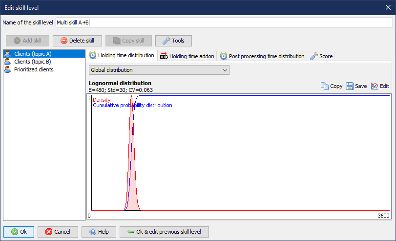
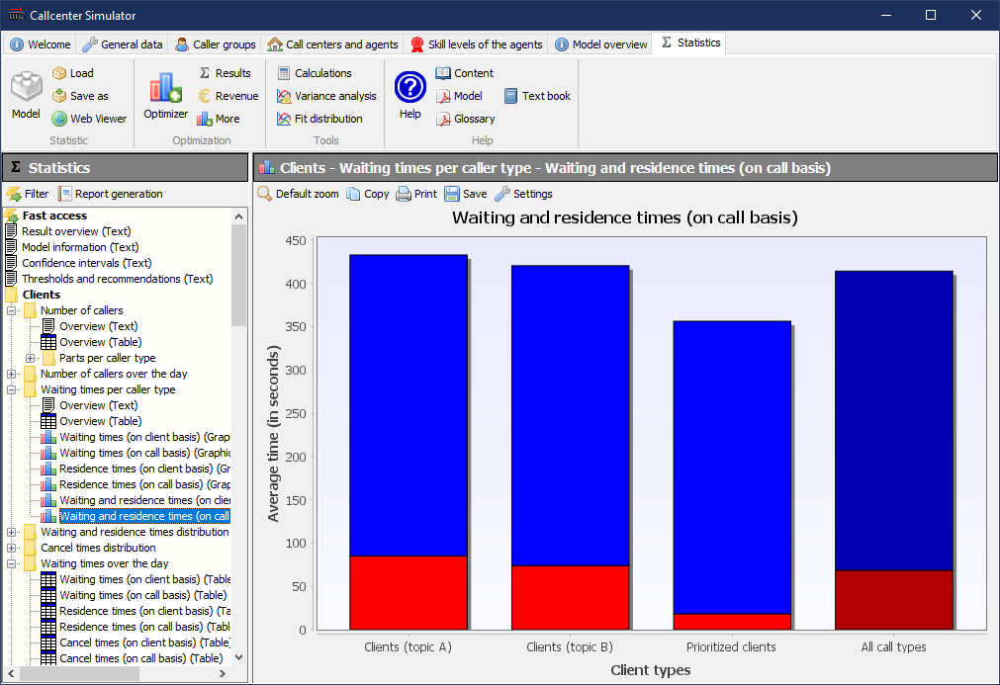

# Callcenter Simulator

([Deutsche Version dieser Readme.](README_de.md))

Callcenter Simulator is a free, platform-independent program for the analysis of staffing requirements in a call center. The simulator uses [event-oriented, stochastic simulation](https://en.wikipedia.org/wiki/Discrete-event_simulation "Wikipedia") for the computation of the parameters.

In order to estimate the necessary staffing levels in a complex call center system, formulas more than 100 years old are often still used, which do not represent many of the relevant characteristics of such a system at all and therefore not only provide biased results, but cannot be used at all for many what-if analyses. With the help of simulation it is possible to model a real call center system including all relevant properties and to determine all common parameters.

**Model properties reflected by Callcenter Simulator**

* Varying rate of incoming calls throughout the day
* Various types of customers
* Different agent types (and thereby single and multi-skill)
* Customer impatience and redialing
* Optional change of customer type in case of a repetition (e.g. from call to e-mail)
* Forwarding
* Various customer priorities
* Splitting of agents to different call centers (with different call prices etc.)

## Download

* [Windows installer](https://github.com/A-Herzog/Callcenter-Simulator/releases/latest/download/CallcenterSimulatorSetup.exe)
* [Zip file](https://github.com/A-Herzog/Callcenter-Simulator/releases/latest/download/CallcenterSimulator.zip) (for use under Windows, Linux, MacOS, ...)
* [Source code](https://github.com/A-Herzog/Callcenter-Simulator/releases/latest/) ([Notes on the build process](BUILD.md))

The Windows version can be installed with or without admin rights. The zip file version can be used on any platform without installation.

* System requirements: [Java 8 or higher](https://adoptopenjdk.net/ "Download Java from adoptopenjdk.net")
* License: [Apache License 2.0](https://opensource.org/licenses/Apache-2.0) (for Callcenter Simulator, the used libraries are partly subject to different open source licenses)

---

## Features

#### Realistic planning and optimization

  
The often used Erlang-C formula does not take into account many parameters such as customer impatience, call repetitions, forwarding, etc., and therefore does not reflect the actual state very well and therefore does not allow any predictions about the effects of changes to the system.
 

#### Optimization of processes and workload

  
The simulation model maps the entire call center system including all special properties. This allows you to optimise staffing requirements in combination with other economic factors.
 

#### Modelling of multi-skill systems

  
Callcenter Simulator supports any number of agent groups with any skills. Multi-skill agents, forwarding of customers depending on the skill level of the serving agent, etc. can thus be easily mapped.
 

#### What-if studies

  
Many tools for personnel requirements planning rely on "historical data" or work "linearly". However, if you do not only want to simulate the past, and since the world is not linear, these do not provide any information about the influence that changes in the control strategy would have.
 

## Further information and literature

* [Schematic diagram of the mapped call center model](https://a-herzog.github.io/Callcenter-Simulator/CallcenterSimulatorModell_en.pdf) (pdf)
* [A. Herzog: "Callcenter – Analyse und Management"](https://www.springer.com/de/book/9783658183080)  (in German)
