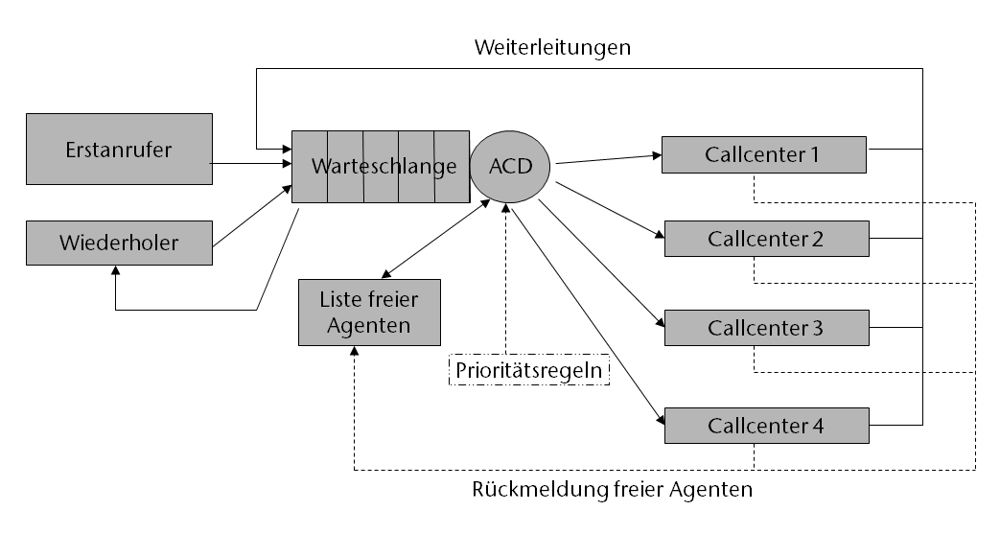
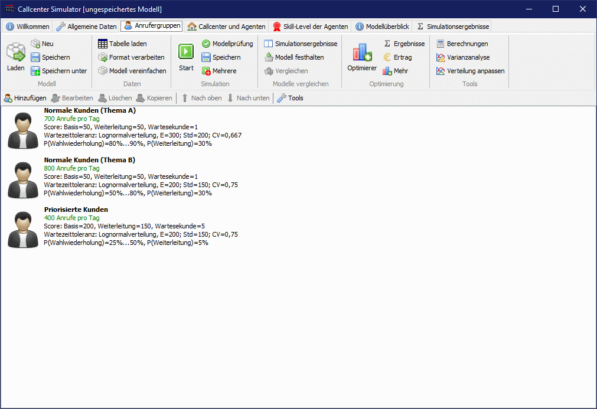
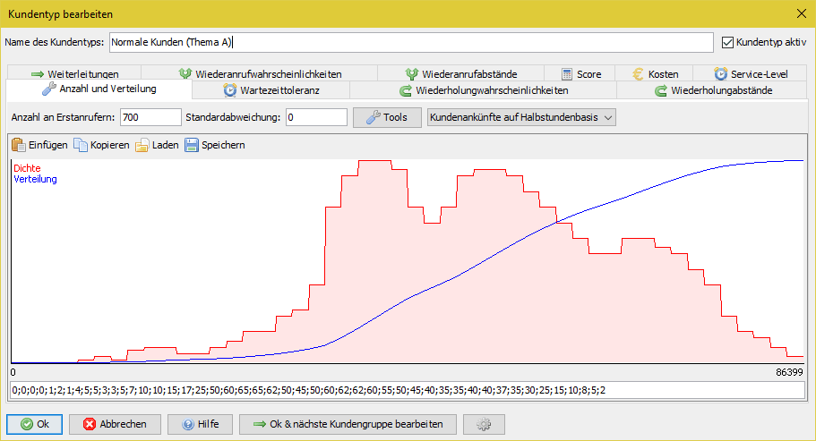
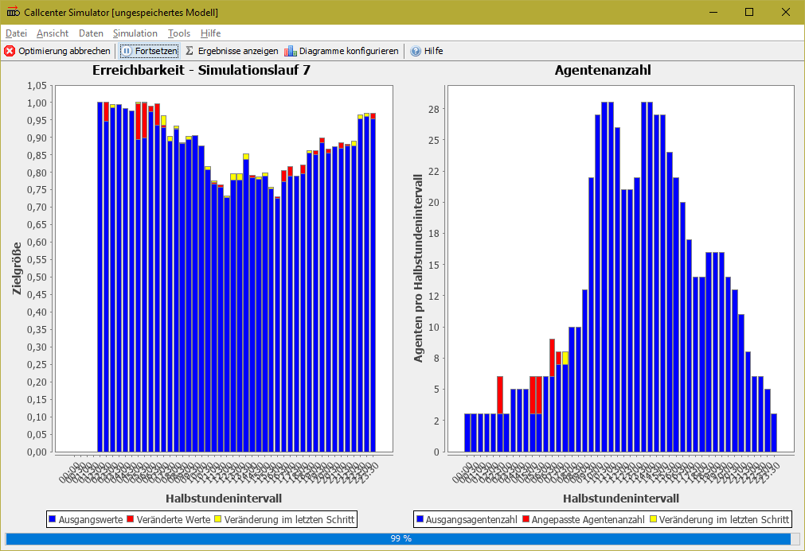
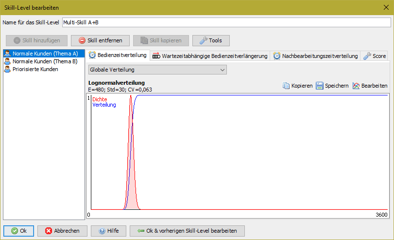
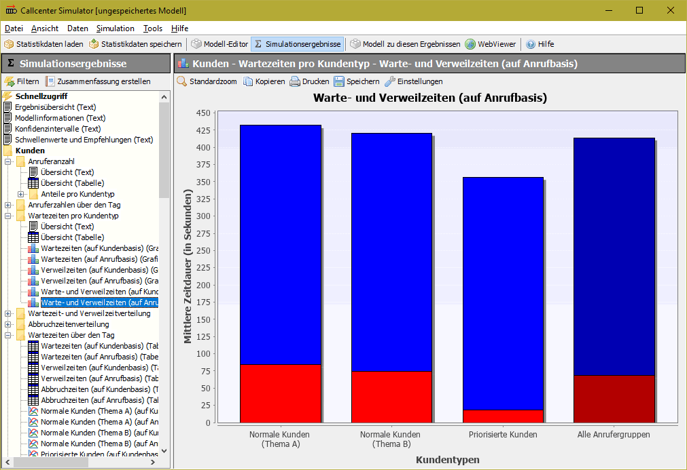

# Callcenter Simulator

([English version of this readme.](README_en.md))

Der Callcenter Simulator ist ein freies, plattformunabhängiges Programm zur Analyse des Personalbedarfs in einem Callcenter. Der Simulator nutzt zur Berechnung der Kenngrößen [ereignisorientierte, stochastische Simulaton](https://en.wikipedia.org/wiki/Discrete-event_simulation "Wikipedia").

Um die notwendige Bedienleistung in einem komplexen Callcenter System abschlätzen zu können, werden vielfach immer noch über 100 Jahre alte Formeln eingesetzt, die viele der relevanten Eigenschaften eines solchen Systems überhaupt nicht abbilden und folglich nicht nur verzerrte Ergebnisse liefern, sondern für viele Was-wäre-wenn-Analysen überhaupt nicht eingesetzt werden können. Mit Hilfe von Simulation ist es möglich, ein reales Callcenter System inkl. aller relevanten Eigenschaften abzubilden und alle üblichen Kenngrößen zu ermitteln.

**Vom Callcenter Simulator abgebildete Modelleigenschaften**

* Schwankender Anrufeingang über den Tag
* Verschiedene Kundentypen
* Verschiedene Agententypen (und dabei Single- und Multi-Skill)
* Ungeduld der Kunden und Wahlwiederholungen
* Optionaler Wechsel des Kundentyps bei einer Wiederholung (z.B. von Anruf auf E-Mail)
* Weiterleitungen
* Verschiedene Kundenprioritäten
* Aufteilung der Agenten auf verschiedene Callcenter (mit verschiedenen Call-Preisen usw.)

## Download

* [Windows-Installer](https://github.com/A-Herzog/Callcenter-Simulator/releases/latest/download/CallcenterSimulatorSetup.exe)
* [zip-Datei](https://github.com/A-Herzog/Callcenter-Simulator/releases/latest/download/CallcenterSimulator.zip) (nutzbar unter Windows, Linux, MacOS, ...)
* [Quellcode](https://github.com/A-Herzog/Callcenter-Simulator/releases/latest/) ([Hinweise zum Build-Prozess](BUILD.md))

Die Windows-Version kann sowohl mit als auch ohne Admin-Rechte installiert werden. Die zip-Datei-Variante kann auf jeder Plattform ohne Installation verwendet werden.

* Systemvoraussetzung: [Java 8 oder höher](https://adoptopenjdk.net/ "Java von adoptopenjdk.net herunterladen")
* Lizenz: [Apache License 2.0](https://opensource.org/licenses/Apache-2.0) (für den Warteschlangensimulator, die verwendeten Bibliotheken unterliegen zum Teil abweichenden Opensource-Lizenzen)

---

## Features

#### Realitätsnahe Planung und Optimierung

  
Die häufig eingesetzte Erlang-C Formel berücksichtigt viele Parameter wie die Ungeduld der Kunden, Anrufwiederholungen, Weiterleitungen usw. nicht, bildet den Ist-Zustand daher nur sehr schlecht ab und ermöglicht folglich auch keine Prognosen, welche Auswirkungen Änderungen an dem System hätten.
 

#### Optimierung der Abläufe und der Arbeitsauslastung

  
Das Simulationsmodell bildet das gesamte Callcenter-System inklusive aller speziellen Eigenschaften ab. So lässt sich der Personalbedarf im Zusammenhang mit anderen wirtschaftlichen Faktoren optimieren.
 

#### Modellierung von Multi-Skill-Systemen

  
Der Callcenter Simulator unterstützt beliebig viele Agentengruppen mit beliebigen Skills. Multi-Skill-Agenten, Weiterleitungen von Kunden in Abhängigkeit des Skill-Levels des bedienenden Agenten usw. sind somit problemlos abbildbar.
 

#### Was-wäre-wenn Untersuchungen

  
Viele Werkzeuge zur zur Personalbedarfsplanung setzen auf „historische Daten“ oder arbeiten „linear“. Soll jedoch nicht nur die Vergangenheit nachgestellt werden und da die Welt nicht linear ist, liefern diese keine Erkenntnisse darüber, welchen Einfluss Änderungen der Steuerungsstrategie hätten.
 

## Material und Literatur

* [Schematische Darstellung des abgebildeten Callcenter-Modells](https://a-herzog.github.io/Callcenter-Simulator/CallcenterSimulatorModell_de.pdf) (pdf)
* [A. Herzog: "Callcenter – Analyse und Management"](https://www.springer.com/de/book/9783658183080)

"Callcenter – Analyse und Management" mit BibTeX zitieren:

    @book{herzog2017callcenter,
      title={Callcenter--Analyse und Management},
      author={Herzog, Alexander},
      year={2017},
      publisher={Springer}
    }